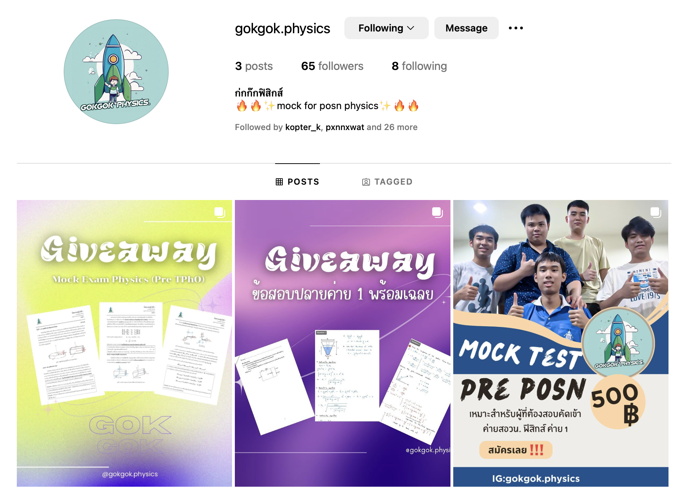

# Gokgok Physics Website

Welcome to my first web development project!

This website is created to support and showcase **Gokgok Physics**, my educational page where I share physics knowledge, insights, and interesting experiments.  
You can visit the official page here: [Gokgok Physics on Instagram](https://www.instagram.com/gokgok.physics/).

## About This Project

This project is my very first attempt at building a website.  
It is designed to introduce visitors to Gokgok Physics, present the purpose of the page, and connect them to physics learning content in a fun and accessible way.

Through this project, I practiced:
- Basic HTML, CSS and Javascript
- Responsive web design
- Embedding external links
- Building a simple and clean layout

## Link to My Page

🌟 [Visit Gokgok Physics Instagram](https://www.instagram.com/gokgok.physics/)

## Future Plans
In the future, I plan to expand this website by:
- Adding more pages about different physics topics
- Creating interactive experiments
- Posting blog-style updates about my latest activities

## Acknowledgments
Thank you for visiting! This website is just the beginning of my journey into web development and sharing the love of physics with the world.
